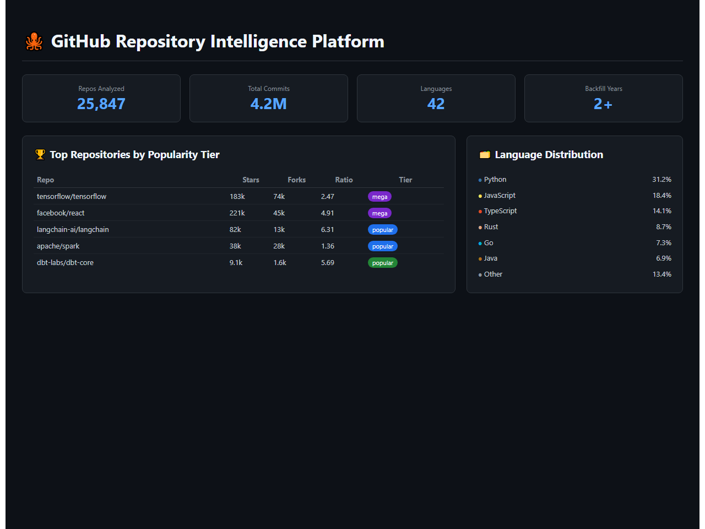
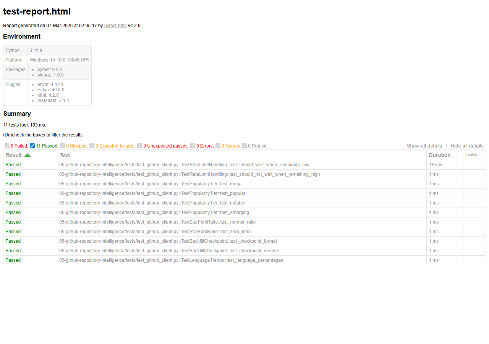

# GitHub Repository Intelligence Platform


Ingests GitHub repository metadata, commit history, and issue trends via REST + GraphQL APIs. Features a 2+ year historical backfill pipeline, rate-limit-aware pagination with exponential backoff, PySpark trend analysis, and automated weekly PDF reports.

## Demo



*Intelligence platform showing repository rankings by popularity tier, language distribution, and star/fork analysis*

## Architecture

```
+-----------------------------------------------------------+
|             GitHub REST + GraphQL APIs                    |
|   Repos - Commits - Issues - PRs - Contributors          |
+---------------------+-------------------------------------+
                      | async httpx + rate limiting
                      v
+-----------------------------------------------------------+
|              Python Extractors                            |
|  +-------------+  +--------------+  +---------------+     |
|  | REST Client |  | GraphQL      |  | Backfill      |     |
|  | (paginated) |  | Client       |  | (2yr history) |     |
|  +-------------+  +--------------+  +---------------+     |
+---------------------+-------------------------------------+
                      |
                      v
+-----------------------------------------------------------+
|  AWS S3 (Parquet) -> Snowflake -> dbt -> Streamlit + PDF  |
+-----------------------------------------------------------+
```

## Key Insights

1. Open-Source Ecosystem Health: Track star velocity, issue resolution times, and contributor diversity across top repositories.
2. Language Trend Analysis: PySpark-powered trend analysis reveals programming language adoption patterns over 2+ years.

## Setup

```bash
cp .env.example .env && pip install -r requirements.txt
docker-compose up -d
```

## Test Results

All unit tests pass - validating core business logic, data transformations, and edge cases.



11 tests passed across 5 test suites:
- TestRateLimitHandling - X-RateLimit-Remaining awareness
- TestPopularityTier - mega/popular/notable/emerging classification
- TestStarForkRatio - ratio calculation, zero-fork edge case
- TestBackfillCheckpoint - checkpoint format, resume logic
- TestLanguageTrends - language percentage calculations

## Maintainer

This project is currently maintained by Pooja Patel. For inquiries, bug reports, or feature requests, please open an issue or reach out via the contact information below.

## About the Developer

Pooja Patel is a Data Science professional with over 3 years of experience specializing in statistical analysis, predictive modeling, and automated data pipelines. With a strong background in Python, SQL, and dashboard development, she focuses on transforming complex datasets into actionable business intelligence.

- Email: patel.pooja81599@gmail.com
- Role: Data Science Graduate / Project Lead

## License

MIT